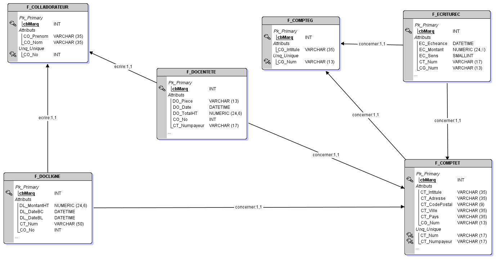

# Projet chef-d'oeuvre

### Titre : Dashboard XO

**Descriptif** : Application web mobile adaptative. 
               Outil de reporting dynamique sous forme de tableau de bord de l'entreprise 
               visuellement attractif et clair.

**Client** : XO Securité (entreprise de vente de vêtements et materiels de sécurité (EPI))
           représenté par Julie Lekesiz, responsable administratif et financier de l'entreprise.
*rajouter contact technique

**Technologie** :
- Front : HTML, CSS (Angular material), Angular.
- Back : Java (SpringBoot, Hibernate) SQL (MySql + H2).

**Fonctionnalités demandées** : 
- Authentification et autorisations (rôles).
- Affichage des indicateurs : 
	- Logistique:
		+ nbre commandes expédiées du jour
		+ nbre colis expédiés du jour (entrée manuelle)
	- Commerce
		+ CA signé et facturé par commercial
		+ CA signé et facturé global
		+ Commandes fournisseurs réceptionnées du jour
		+ Objectif commercial (entrée manuelle)
	- Finance
		+ Encours clients à date 
		+ Encours fournisseurs à date
	- Direction
		+ localisation quantité de clients sur carte
- Entrer un message pour un service.
- Entrer un Objectif commercial (Commerce)
- Entrer le nombre de colis expédiés du jour (Logistique)

**Fonctionnalités rajoutées** :
- Gestion des authentifications et autorisations par l'administrateur.

**Convention de code** : 
L'application doit respecter certaines règles d'accessibilité et de sécurité.
Elle devra être compatible avec les navigateurs principaux (IE, Chrome, Firefox).
Le code devra être lisible, indenté de manière correcte et commenté afin d'y 
revenir facilement pour modification.
Elle devra passer par le W3C validator (accessibilité et respect du code),
+ le OWASP (test de vulnérabilité),
+ le "Audits" de Google Chrome (SEO, performance, accessibilité).
Elle devra également respecter les règles d'éco-conception ( éviter les requêtes
excessives aux BDD, éviter les imports inutils, consommation de ressources...).

*Convention de nommage* : 
- Langue utilisé dans le code : Francais (attributs, classes) et Anglais (méthodes, variables, commentaires...).
- CamelCase.
- Méthodes courtes.
- Pas de répétions de code.
- Respect des conventions de nommage Angular.

**Mise en oeuvre** :

Méthode pseudo-agile avec des points réguliers de l'avancement de l'application avec le client.
Outil utilisé pour l'organisation : site Trello (tableau Kanban).
Versionning régulier avec GIT.

**Diagrammes** : 

- Diagramme Use Case
- Diagramme d'activité
- Diagramme de classes (en cours...)
- MCD, MLD, MPD

#### Diagramme Use Case

#### Diagramme d'activité

#### MCD Appli

#### MLD Appli

#### MCD XO

#### MLD XO

#### Enchainement vues mobiles (cinématique).

#### Enchainement vues web (cinématique).

**Visuels de l'application.** (en cours...)

**Explications de codes spécifiques avec des exemples : Front et Back.** (en cours...)

**Quelqes exemples de tests unitaires.** (en cours...)

**CUs de chaque fonctionnalités avec diagrammes de séquence et visuels. (Annexes)** (en cours...)

**Explication de chaque tables des BDD** :

*En lecture seulement*
- F_DOCENTETE : Documents (factures, avoirs, bordereaux de livraison...). (*R*)
- F_COLLABORATEUR : Employés de XO. (*R*)
- F_ECRITUREC: Ecritures comptables (montants, echéances...). (*R*)
- F_COMPTET : Comptes Tiers (clients, fournisseurs, etc...). (*R*)
- F_COMPTEG : Comptes Généraux (toutes les sortes de comptes: clients, fournisseurs, banques...). (*R*)

*CRUD*
- MESSAGES : Messages pour un service. (*CRUD*)
- OBJECTIFSCOMMERCE : Objectifs commerciaux. (*CRUD*)
- COLISEXPEDIES : Colis expédiés. (*CRUD*)
- USERS : Mots de passes, identifiants. (*CRUD*)
- ROLES : liste des rôles. (*R*)

**Explication de chaque package (back)** :

- Model : Les classes java représentant les tables des bases de données.
- Repository : Contient les interfaces qui utilisent Hibernate JPA pour stocker/récupérer les données de la BDD.
- Controller : Définit les adresses RestApi pour le partage des données en JSON entre les Front et le Back.
- Service : Définit le CRUD (méthodes en lien direct avec le repository).
- Security : Partie sécurité du projet (Spring Security, jwt security).
- Exception : Gestion des exceptions.

**Rôles** :

- ROLE_LOGISTIQUE
- ROLE_COMMERCE
- ROLE_FINANCE
- ROLE_DIRECTION
- ROLE_ADMIN

**Components Angular (front)** :

- LogInComponent
- HeaderComponent
- FooterComponent
- DashboardLogisticComponent
- DashboardCommerceComponent
- DashboardFinanceComponent
- DashboardDirectionComponent
- AdminComponent
- LogInService
- XoService
- MessagesService
- ObjectifsService
- ColisService
- Message (model)
- Objectif (model)
- Colis (model)
- Collaborateur (model)
- EcritureComptable (model)
- CompteTiers (model)
- Document (model)
- User (model)
- Role (model)

**Dépendances Back** :

- Spring Boot Starter WEB
- Spring Boot Starter JDBC
- Spring Boot Starter JPA
- Spring Boot Starter Security
- Driver MySQL
- Driver H2
- Hibernate
- Json Web Token
- DevTools

**Logiciels utilisés** :
- Balsamiq Mockup 3 : maquettes wireframe.
- JMerise : MCD, MLD, MPD.
- StarUML (version 3.0.2) : diagrammes UML.
- Photoshop : visuels documentation (cinématique des pages..).
- Google Slides : présentation titre pro.
- word : documentation CUs.
- Eclipse Java EE (version 4.9.0) : programmation Back application.
- Postman (version 7.0.6) : Tests API Back.
- Visual Studio Code (version 1.32.3) : programmation Front application.
- CLI : pour MySQL, Angular.

